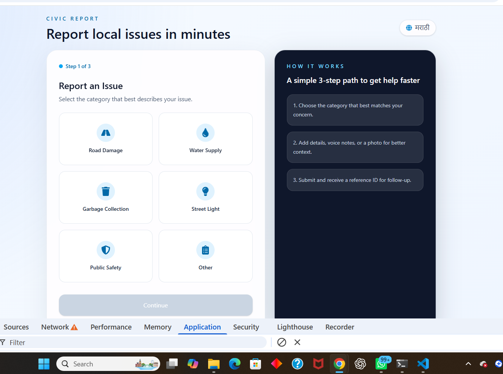
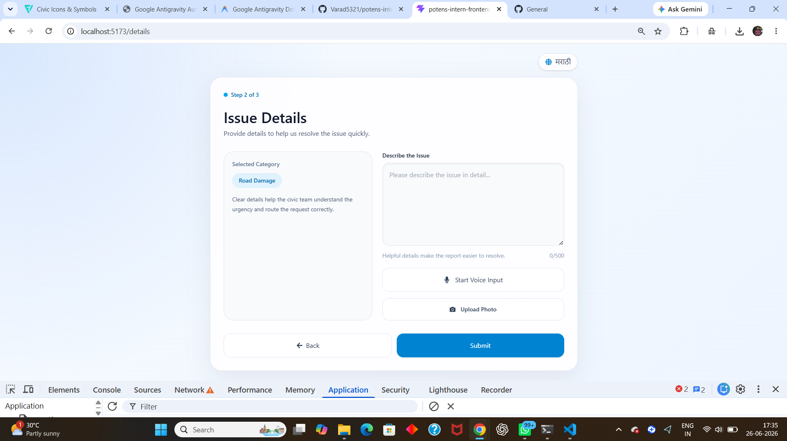
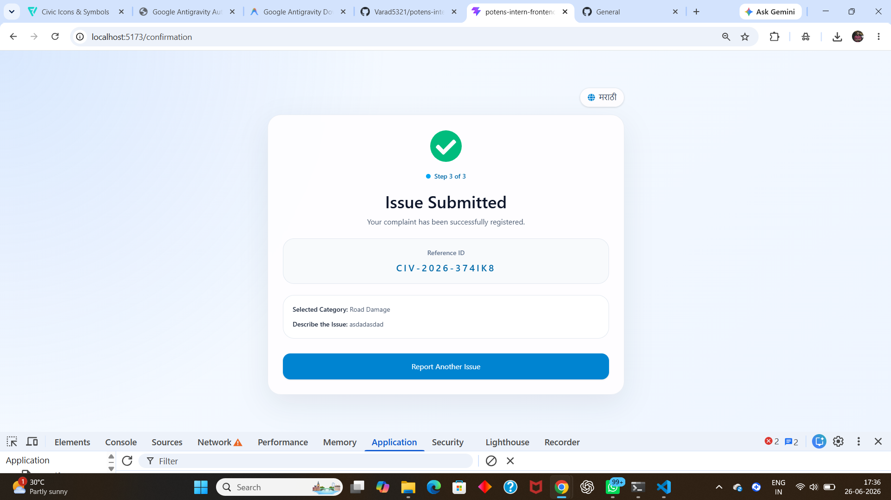

# Civic Issue Reporter PWA

A mobile-first Progressive Web Application (PWA) that allows citizens to report civic issues quickly and intuitively. Users can select an issue category, describe the issue using text, voice, and images, and receive a unique reference ID upon submission.

## Live Demo

[potens-intern-frontend-varad-wanwas.vercel.app]

## Features

- 📱 Mobile-first responsive design
- 🌐 Full bilingual support (English + Marathi)
- 🎤 Voice input using Web Speech API
- 📷 Photo upload support
- 💾 LocalStorage persistence (no backend required)
- ⚡ Installable PWA
- 📶 Optimized for low-bandwidth / slow 3G scenarios
- ✨ Thoughtful micro-interactions and smooth UI feedback

## Tech Stack

- React
- TypeScript
- Tailwind CSS
- React Router DOM
- react-i18next
- Vite
- vite-plugin-pwa

---

# How to Run

## Clone repository

```bash
git clone <https://github.com/Varad5321/potens-intern-frontend-varad-wanwase.git>
cd potens-intern-frontend-varad
```

## Install dependencies

```bash
npm install
```

## Start development server

```bash
npm run dev
```

Application runs on:

```bash
http://localhost:5173
```

## Build for production

```bash
npm run build
```

## Preview production build

```bash
npm run preview
```

Application runs on:

```bash
http://localhost:4173
```

---

# Design Decisions

## Mobile-first approach

The application was designed mobile-first because civic reporting is most likely to happen on mobile devices while users are on-site.

## Three-step flow

The reporting experience was intentionally reduced to three focused screens:

1. Category Selection
2. Issue Details
3. Confirmation

This minimizes cognitive load and makes the process fast and intuitive.

## Bilingual support

English and Marathi were selected to improve accessibility and inclusiveness for regional users. All visible labels, buttons, and placeholders switch languages using react-i18next.

## No backend

The assignment explicitly allowed a frontend-only implementation. Therefore, submissions are persisted using localStorage to simulate report storage while keeping the application fully functional.

## Progressive Web App

PWA support was added to make the application installable and usable under poor network conditions.

## Micro-interactions

Subtle animations, category selection feedback, and vibration feedback on successful submission were introduced to make the experience feel considered without becoming distracting.

---

# What Is Broken / Unfinished

- Uploaded images are currently not persisted in localStorage. Only the image file name is stored.
- Voice recognition support depends on browser compatibility and works best in Chromium-based browsers.
- Offline submission queue and background synchronization are not implemented.
- No backend integration exists; all submissions remain on the client.

---

# What I Would Build Next

If given more time, I would implement:

- Offline-first submission queue with Background Sync API.
- Backend integration for real report persistence.
- Complaint status tracking and timeline view.
- Push notifications for complaint updates.
- User authentication and profile management.
- WCAG accessibility audit and further accessibility improvements.

---

# Project Structure

```text
src/
├── components/
│   └── LanguageToggle.tsx
├── pages/
│   ├── CategoryPage.tsx
│   ├── DetailsPage.tsx
│   └── ConfirmationPage.tsx
├── i18n/
│   └── i18.ts
├── locals/
│   ├── en.json
│   └── mr.json
├── types/
│   └── index.ts
├── utils/
│   └── submission.ts
├── App.tsx
└── main.tsx
```

---

# Non-Obvious Code Comments

Comments were intentionally added only to non-obvious sections such as:

- Web Speech API integration.
- Reference ID generation logic.
- localStorage persistence flow.
- PWA configuration.
- Language switching implementation.

Obvious implementation details and standard control structures were intentionally left uncommented.

---

# AI Use Log

| Tool | Approximate Usage | Purpose |
|-------|------------------|---------|
| ChatGPT | ~150 prompts | Architecture discussions, debugging, PWA setup, i18n implementation, UI/UX refinement, accessibility improvements, README guidance |
| GitHub Copilot | Active throughout development | Code completion, refactoring suggestions, component scaffolding, and code review assistance |

---

# Screenshots




